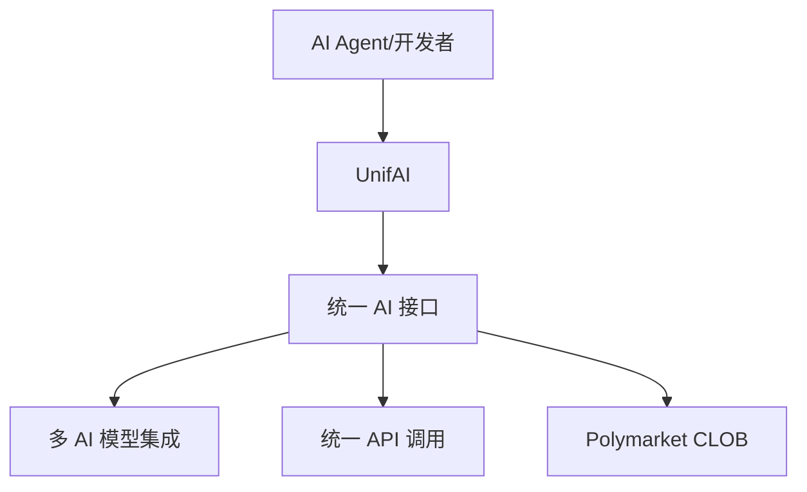
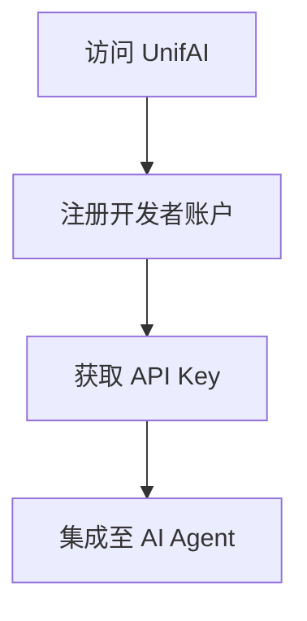
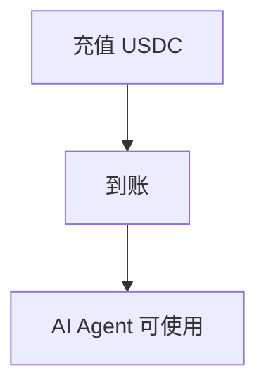
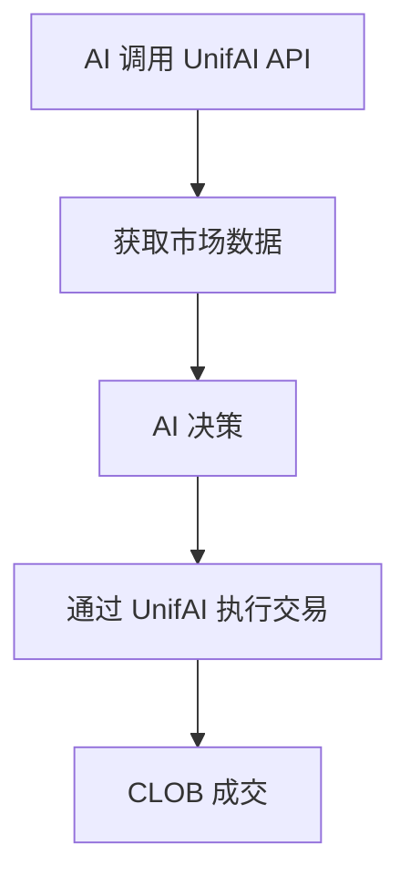
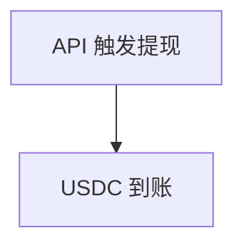
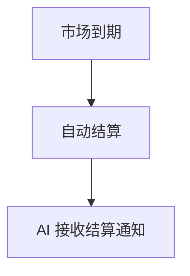

# UnifAI — 深度分析报告

> 数据日期：2026-03-24  
> Polymarket Builder Program 排名：**#48**  
> 近1月交易量：**$301.3k**

---

## 1. 概况

- 排名 **#48**，月交易量 **$301.3k**
- 「UnifAI」= Unify + AI，暗示**统一多个 AI 能力**或**AI 驱动的统一交易接口**
- 可能是 AI Agent 框架接入 Polymarket 的基础设施工具

---

## 2. 推断定位

---

## 3. 用户流程（推断）

### 2.0 核心 UX 路径

#### 2.0.1 注册流程

#### 2.0.2 入金流程

#### 2.0.3 AI 交易流程

#### 2.0.4 提现流程

#### 2.0.5 结算流程

---

## 3. 待确认问题

- [ ] 真实网址
- [ ] 是面向开发者还是普通用户
- [ ] 支持哪些 AI 模型
- [ ] 与 Simmer 的差异化
- [ ] 团队背景

## 4. 总结

UnifAI 月交易量 **$301.3k**（#48），AI 统一接口定位，可能是 AI Agent 接入 Polymarket 的基础设施层。
