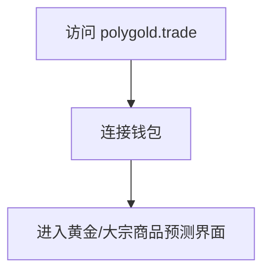
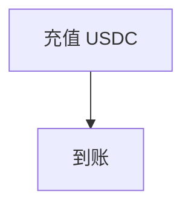
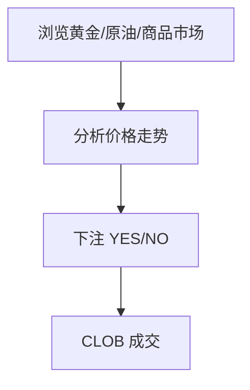
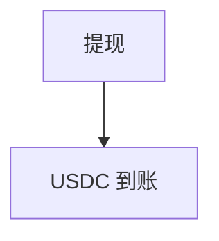
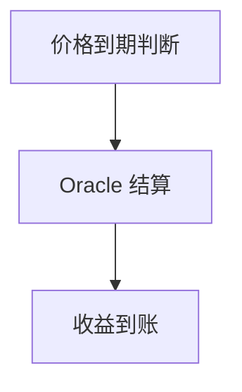

# PolyGold.Trade — 深度分析报告

> 数据日期：2026-03-24  
> Polymarket Builder Program 排名：**#49**  
> 近1月交易量：**$291.5k**

---

## 1. 概况

- 排名 **#49**，月交易量 **$291.5k**
- 「PolyGold」= Polymarket + Gold（黄金），可能专注于**大宗商品/黄金相关预测市场**
- 或「Gold」代表高端/优质，暗示高级交易工具

---

## 2. 用户流程（推断）

### 2.0 核心 UX 路径

#### 2.0.1 注册流程

#### 2.0.2 入金流程

#### 2.0.3 大宗商品预测交易流程

#### 2.0.4 提现流程

#### 2.0.5 结算流程

---

## 3. 待确认问题

- [ ] polygold.trade 实际内容
- [ ] 是否专注大宗商品市场
- [ ] 团队背景

## 4. 总结

PolyGold.Trade 月交易量 **$291.5k**（#49），黄金命名暗示大宗商品预测专区或高端品牌定位。
