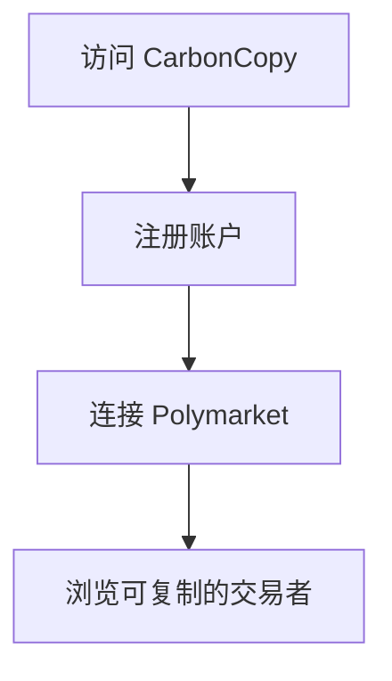
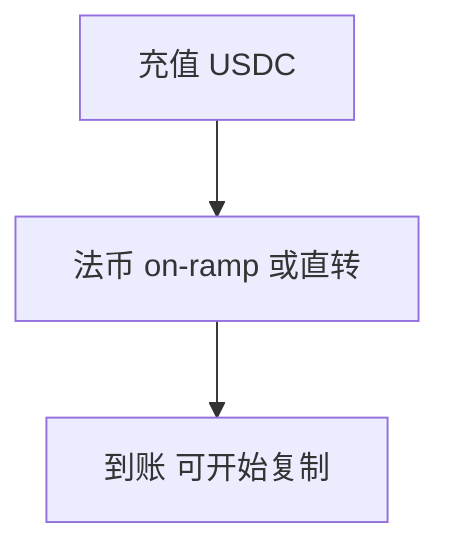
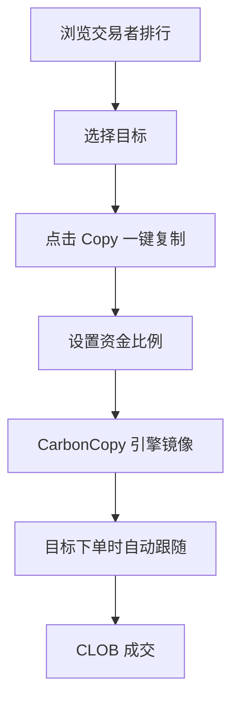
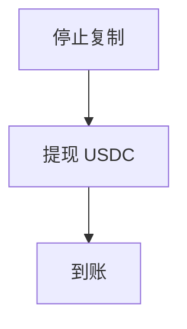
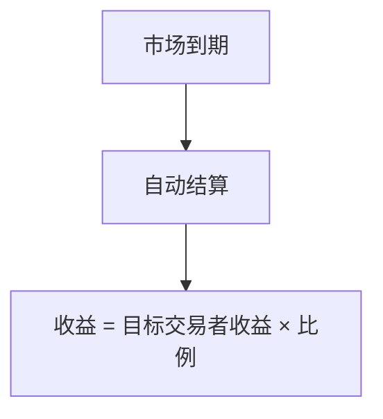

# CarbonCopy — 深度分析报告

> 数据日期：2026-03-24  
> Polymarket Builder Program 排名：**#50**  
> 近1月交易量：**$270.9k**

---

## 1. 概况

- 排名 **#50**，月交易量 **$270.9k**
- 「CarbonCopy」= 复写纸/完全复制，直接暗示**复制交易功能**
- 名称含义：完全照抄别人的交易（Carbon Copy = 一模一样的副本）
- 是复制交易赛道中命名最直白的产品

---

## 2. 与其他复制交易平台对比

| 对比维度 | CarbonCopy | PolyCop | Polydupe | Olympusx |
|---------|-----------|---------|---------|----------|
| 月交易量 | $270.9k | $52.9M | $3.06M | $4.93M |
| 排名 | #50 | #2 | #17 | #12 |
| 托管方式 | 待确认 | 托管 | 非托管 | 非托管(Privy) |
| 特色 | 待确认 | 聪明钱算法 | 按比例复制 | 手动+复制 |

---

## 3. 用户流程（推断）

### 2.0 核心 UX 路径

#### 2.0.1 注册流程

#### 2.0.2 入金流程

#### 2.0.3 复制交易流程

#### 2.0.4 提现流程

#### 2.0.5 结算流程

---

## 4. 待确认问题

- [ ] 真实网址
- [ ] 与 PolyCop/Polydupe 的核心差异化
- [ ] 托管方式
- [ ] 费率结构（固定费 or 盈利抽成）
- [ ] 团队背景

## 5. 总结

CarbonCopy 月交易量 **$270.9k**（#50，TOP 50 末位），复制交易赛道竞争激烈（PolyCop $52.9M、Polydupe $3.06M），后发劣势明显。需找到差异化才能突破。
