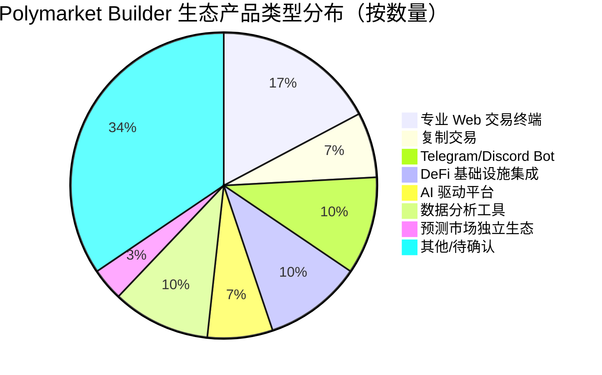
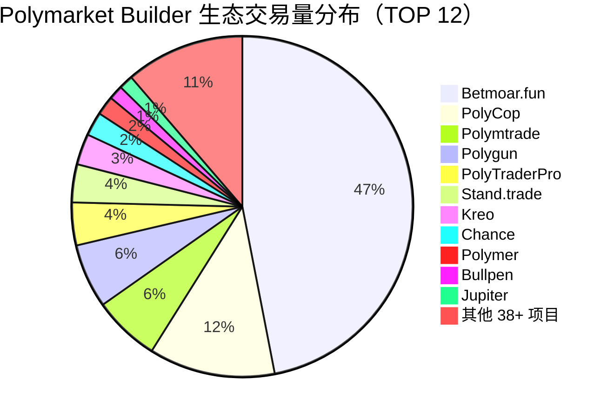
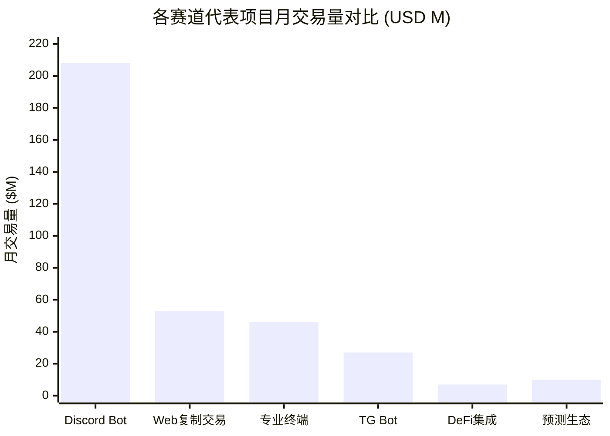
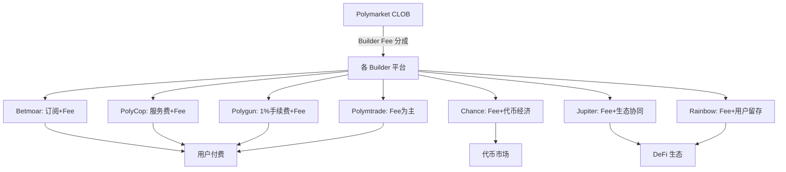
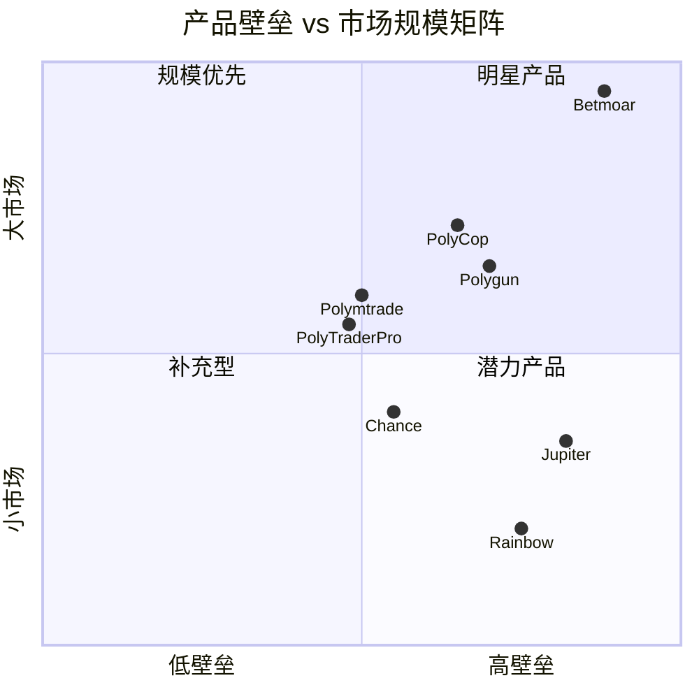
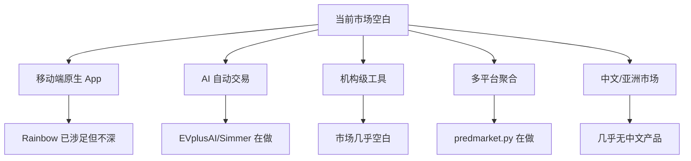

# Polymarket Builder 生态全景汇总报告

> 数据日期：2026-03-24  
> 数据来源：builders.polymarket.com + 各平台官网调研

---

## 1. 生态总览

### 1.1 Builder Program 核心数据

| 排名 | 项目 | 近1月交易量 | 类型 | 调研状态 |
|------|------|------------|------|----------|
| 1 | **Betmoar.fun** | $208.08M | Discord Bot + 专业终端 | ✅ 完整 |
| 2 | **PolyCop** | $52.93M | Web 端复制交易 | ✅ 完整 |
| 3 | **Polymtrade** | $28.30M | 专业 Web 交易终端 | ✅ 完整 |
| 4 | **Polygun** | $27.44M | Telegram 交易 Bot | ✅ 完整 |
| 5 | **PolyTraderPro** | $17.96M | 专业 Web 交易终端 | ✅ 完整 |
| 6 | **Stand.trade** | $16.46M | Web 交易平台 | ⚠️ 待补充 |
| 7 | **Kreo** (kreo.app) | $12.72M | 多平台信息流+钱包追踪+做市 | ✅ 完整 |
| 8 | **Chance** | $9.99M | 前端+L1规划+代币 | ✅ 完整 |
| 9 | **Polymer** | $7.65M | 待确认（域名未找到） | ⚠️ 待补充 |
| 10 | **Bullpen** | $5.86M | 待确认（域名未找到） | ⚠️ 待补充 |
| 11 | **Jupiter** | $5.82M | Solana DEX 聚合器 | ✅ 完整 |
| 12 | **Olympusx.app** | $4.93M | 非托管复制交易+手动终端 | ✅ 完整 |
| 13 | **EVplusAI** | $3.61M | AI 多平台交易终端 | ✅ 完整 |
| 14 | **PolyMaker.bet** | $3.54M | 做市商工具+Bond APR | ✅ 完整 |
| 15 | **Polytrader.app** | $3.35M | 自托管交易终端 | ✅ 完整 |
| 16 | **Onsight** | $3.35M | 待调研 | 🔲 未调研 |
| 17 | **Polydupe** | $3.06M | 非托管复制交易(2.5%盈利抽成) | ✅ 完整 |
| 18 | **PolyBot** | $2.97M | Bot | 🔲 未调研 |
| 19 | **Simmer.Markets** | $2.66M | AI Agent 预测市场 | ✅ 完整 |
| 20 | **Sharkbetting.com** | $2.44M | 传统套利/匹配投注工具 | ✅ 已了解 |
| 21 | **swaps.xyz** | $2.31M | 跨链 Swap (MoonPay旗下) | ✅ 已了解 |
| 22 | **Polycule** | $2.06M | 待调研 | 🔲 未调研 |
| 23 | **Polymarket Eye** | $1.94M | 链上数据分析+Sus检测 | ✅ 完整 |
| 24 | **DGPredict** | $1.88M | 待调研 | 🔲 未调研 |
| 25 | **Rainbow** | $1.46M | 以太坊钱包集成 | ✅ 完整 |
| 33 | **Almanac.market** | $1.02M | 早期预测激励(Yield路由) | ✅ 完整 |
| ... | 更多 25+ 项目 | ... | ... | 🔲 未调研 |

**生态总月交易量（TOP 50）：估计超 $530M+/月**

---

## 2. 产品类型分布

---

## 3. 赛道对比分析

### 3.1 各赛道交易量对比

### 3.2 各赛道特征对比

| 赛道 | 代表项目 | 核心壁垒 | 用户群 | 商业模式 | 增长潜力 |
|------|---------|---------|--------|---------|----------|
| Discord Bot | Betmoar | 渠道+官方认证 | 社区用户 | Builder Fee + 订阅 | ★★★★★ |
| 复制交易 | PolyCop | 数据积累+算法 | 普通散户 | Fee + 服务费 | ★★★★☆ |
| TG Bot | Polygun | 渠道+病毒增长 | 移动端用户 | 1% 手续费 | ★★★★★ |
| 专业终端 | Polymtrade | UX积累+信任 | 专业交易者 | Builder Fee | ★★★☆☆ |
| DeFi集成 | Jupiter | 用户基数 | DeFi 原住民 | Builder Fee | ★★★★☆ |
| 独立生态 | Chance | 代币经济+L1 | 投机者+用户 | 代币+手续费 | ★★★☆☆ (高风险) |

---

## 4. 商业模式全景

### 4.1 Builder Fee 收入测算（TOP 12）

| 项目 | 月交易量 | 估算 Builder Fee (0.5%) | 月收入估算 |
|------|---------|------------------------|----------|
| Betmoar | $208M | $1,040k | **$1.04M+** |
| PolyCop | $52.9M | $264k | $264k+ |
| Polymtrade | $28.3M | $141k | $141k+ |
| Polygun | $27.4M | $137k + 1%手续费=$274k | **$411k+** |
| PolyTraderPro | $18M | $90k | $90k+ |
| Stand.trade | $16.5M | $82k | $82k+ |
| Kreo | $12.7M | $63k | $63k+ |
| Chance | $10M | $50k | $50k+ |
| Polymer | $7.65M | $38k | $38k+ |
| Bullpen | $5.86M | $29k | $29k+ |
| Jupiter | $5.82M | $29k | $29k+ |
| Rainbow | $1.46M | $7k | $7k+ |

> 注：Builder Fee 实际费率取决于与 Polymarket 的具体协议，0.5% 为估算值。各平台可能有额外手续费收入。

---

## 5. 技术壁垒对比雷达图

---

## 6. 关键趋势与洞察

### 趋势一：渠道即壁垒
Betmoar（Discord）和 Polygun（Telegram）的成功证明，**接入用户已有的通讯习惯**比构建独立 Web 平台更有效。两者合计月交易量 $235M，占 TOP 12 的近 **50%**。

### 趋势二：DeFi 基础设施向预测市场扩张
Jupiter（Solana DEX 聚合器）和 Rainbow（以太坊钱包）的接入，说明成熟 DeFi 项目将预测市场视为**功能扩展的重要方向**。未来可能有更多 DEX、钱包、借贷协议接入。

### 趋势三：复制交易需求旺盛
PolyCop（$52.9M）和 Polygun 的复制交易功能证明，**降低研究门槛**是普通用户最大痛点。预测市场的复制交易潜力巨大。

### 趋势四：AI 驱动产品崛起
EVplusAI（#13）、Simmer.Markets（#19，「Prediction Markets for the Agent Economy」）等 AI 产品开始出现。**AI Agent 自动交易预测市场**是下一个重要赛道。

### 趋势五：独立生态建设
Chance Markets 的 Chance Chain + Chance Oracle + $PREDICT 代币计划，代表着**从 Polymarket 前端到独立预测市场基础设施**的战略转型。

---

## 7. 市场机会分析

### 7.1 最大市场机会

1. **AI Agent 自动交易**：Polymarket 官方已开源 `agents` 仓库（2620 stars），市场处于早期，先发优势明显
2. **机构级工具**：当前工具均面向散户，机构需要的风控、合规、API 对接工具几乎空白
3. **多平台数据聚合**：同时聚合 Polymarket + Kalshi + Manifold 等多个预测市场的工具稀少
4. **移动端深度整合**：Rainbow 开了头，但原生深度集成仍有空间

---

## 8. 待补充调研清单

### 8.1 需要手动访问的平台（JS 渲染，爬虫无法获取）
- [ ] **Stand.trade** (#6, $16.46M) — Cloudflare 保护，需手动访问
- [ ] **Kreo.trade** (#7, $12.72M) — 页面空白，需手动访问
- [ ] **Bullpen** (#10, $5.86M) — 域名未确认
- [ ] **Polymer** (#9, $7.65M) — 域名未确认
- [ ] **Polymtrade** (#3, $28.30M) — JS 渲染，需手动查看功能

### 8.2 待调研的重要平台
- [ ] **Olympusx.app** (#12, $4.93M)
- [ ] **EVplusAI** (#13, $3.61M) — AI 驱动平台，重要
- [ ] **PolyMaker.bet** (#14, $3.54M)
- [ ] **Simmer.Markets** (#19, $2.66M) — AI Agent 预测市场，重要
- [ ] **Polymarket Eye** (#23, $1.94M) — 数据分析工具
- [ ] **Polycule** (#22, $2.06M)
- [ ] **DGPredict** (#24, $1.88M)

### 8.3 需要确认的关键问题
- [ ] Polymarket Builder Fee 的实际费率和分成机制
- [ ] 各平台的月活用户数据
- [ ] Stand.trade 和 Kreo 的具体产品形态
- [ ] Chance Chain 的技术方案和上线时间表
- [ ] Jupiter × Polymarket 的跨链实现方案
- [ ] PolyCop 和 Polygun 的托管钱包安全方案

---

## 9. 总结

Polymarket Builder 生态已形成多元化的产品矩阵，核心规律是：

1. **渠道为王**：Discord + Telegram Bot 占据生态近 50% 交易量
2. **降低门槛是核心价值**：复制交易、Bot 自动执行都在解决同一问题
3. **DeFi 基础设施是未来增量**：Jupiter、Rainbow 代表了新的接入方式
4. **AI 赛道刚起步**：EVplusAI、Simmer 等是下一波机会
5. **Betmoar 一家独大**：单月 $208M，占 TOP 12 总量约 **40%**，护城河极深

---

*报告由调研工具自动生成，部分数据基于公开信息推断，具体数字以官方公告为准。*
